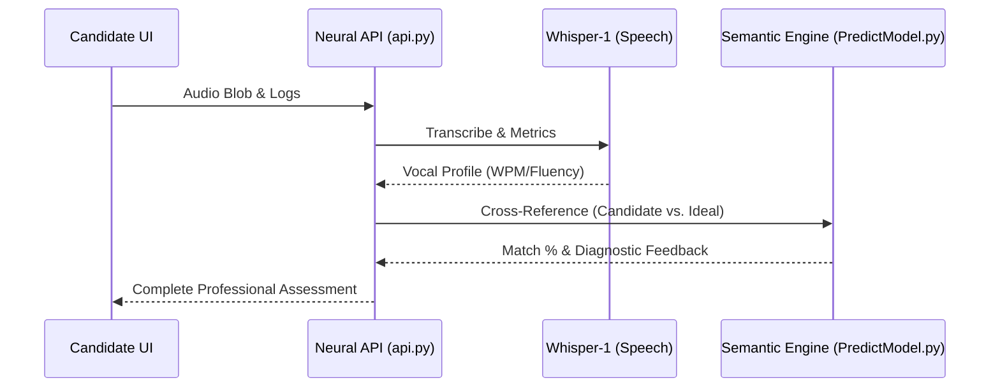

# 🧠 Dynamic Interview: The Backend Neural Engine

  
  
  

---

## 🔬 Core Intelligence Components

### 🖥️ `PredictModel.py`: The Semantic Oracle
*   **Vector Space Mapping**: Maps candidate answers into a high-dimensional vector space using `SentenceTransformer` (all-MiniLM-L6-v2).
*   **Hybrid Matching Logic**: 
  *   **75% Semantic Gist**: Captures the "meaning" behind the response.
  *   **25% Keyword overlap**: Ensures technical precision (e.g., specific libraries or concepts).
*   **GPT-4 Insights**: Provides a **Key Strengths** vs. **Technical Gaps** breakdown for every question.

### 🔌 `api.py`: The Nervous System
*   **Orchestration layer**: Manages the flow between User recording, OpenAI Whisper transcription, and Semantic matching.
*   **Vocal Analysis Engine**: Derived metrics for **WPM**, **fluency**, and **confidence**.
*   **Integrity System**: Heavily penalizes **Tab Switching** and **Paste Attempts** to ensure assessment validity.

---

## 🌊 The Data Journey (Sequence)

---

## ⚙️ Engineering Parameters (`Config.py`)
| Parameter | Default | description |
| :--- | :--- | :--- |
| **Hybrid Split** | 75/25 | Semantic vs. Keyword weighting. |
| **Integrity Threshold** | 0.8+ SECURE | Minimum index for unflagged submission. |
| **Proficiency Tiers** | 90/75/50 | Expert / Proficient / Intermediate boundaries. |

---

## 🧪 Technical Validation
*   `test_local_first.py`: Speed benchmark for local model inference.
*   `Data_Validators.py`: Automated integrity checks for the `interviews_store.json`.

---

  🚀 Build Version v2.6.4 (Neural Optimized)

